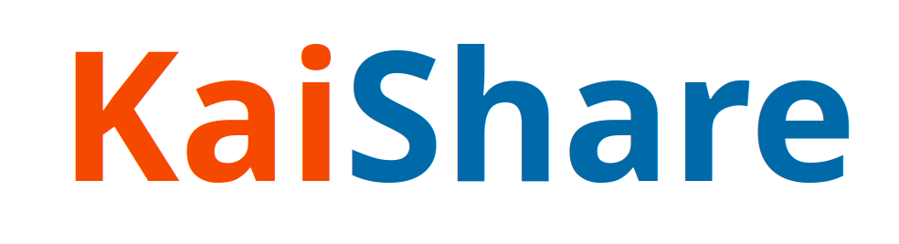
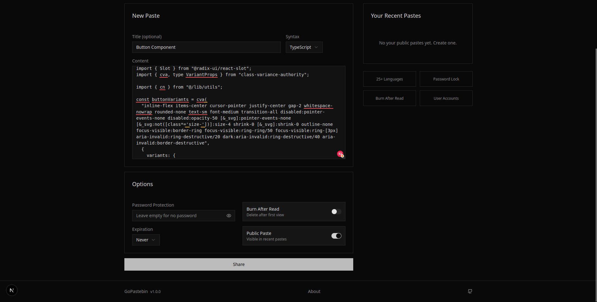
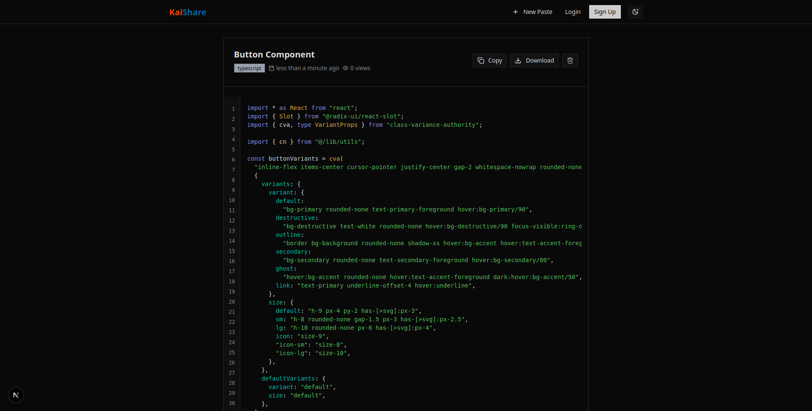

**KaiShare** is a secure platform for sharing code snippets and text with others. Built with a focus on privacy and simplicity, KaiShare helps developers and users exchange information safely—ideal for teams, communities, and individuals working on collaborative coding and knowledge sharing.




- **Note**- <p style="color:red; font-weight:bold;">If you don't  have an account, don't forget to copy the link (like https://kaishare.vercel.app/p/9913f9-d344-11f0-80bb-8c8d28d905b2) after posting, as there is no way to retrieve it later.</p>

## Features

- **Share Code & Text Securely**: Easily share code blocks or plain text with encryption options.
- **Multi-language Support**: Paste and format code in multiple programming languages.
- **Modern UI/UX**: A clean, intuitive interface built with Nextjs.
- **Backend in Go**: Robust and scalable backend services powered by [Go](https://golang.org/).
- **Privacy Focused**: Your shared content is protected, with options for expiry and one-time viewing.


## Technology Stack

- **Frontend:** Nextjs
- **Backend:** Go(gin framework)
- **Database:** PostgreSQL

---

## Getting Started

1. **Clone the Repository**
    ```bash
    git clone https://github.com/JiruGutema/KaiShare.git
    ```

2. **Install Dependencies (Frontend)**
    ```bash
    cd KaiShare/client
    npm install
    ```

3. **Run the Frontend**
    ```bash
    npm run dev
    ```

4. **Run the Backend**
    ```bash
    cd KaiShare/server
    go run cmd/api/main.go
    ```
    you also use `air` to run it in watch mode

5. **Configure Settings**
    - Copy `.env.example` to `.env` in both web and server folders.
    - Update credentials and settings as needed.

---

## Usage

- **Share Content:** Paste your text/code in the web UI, set options (expiry, password protection, etc.), and share the generated link.
- **API Usage:** Integrate via RESTful endpoints for programmatic sharing. See [`/server/docs/API.md`](server/docs/API.md) for details.

---

## Contributing

Contributions are welcome! Please see [`CONTRIBUTING.md`](CONTRIBUTING.md) for guidelines.

---

## License

This project is licensed under the MIT License.  
See [`LICENSE`](LICENSE.md) for more details.

---

## Contact

Created by [@JiruGutema](https://github.com/JiruGutema).

---

```
KaiShare - Share Code & Text Securely
```
